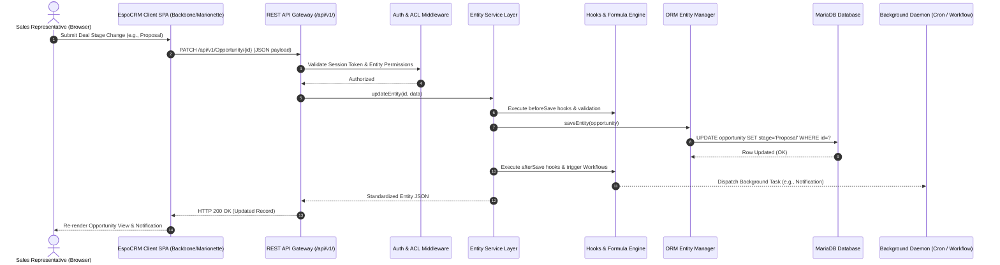

# W5D3: Enterprise CRM Architecture — Workflow, Automation & Reporting

**Program:** Cynaris Solutions Full Stack Development Internship  
**Module:** Week 5 – Day 3: Enterprise CRM Architecture — Workflow, Automation & Reporting  
**Repository Branch:** `feat/w5d3-3m-sachidananda`  
**Base Application:** EspoCRM (Docker Environment)  

---

## 1. Overview

Enterprise Customer Relationship Management (CRM) platforms require robust, decoupled, and extensible software architectures to handle complex business logic, multi-user concurrency, dynamic workflows, and comprehensive data reporting.

This document analyzes the enterprise architecture of **EspoCRM**, examining how its architectural tiers operate together to support core CRM lifecycles. It details the end-to-end **Lead → Opportunity → Account → Activity** business pipeline, explores the technical foundations of workflows, automations, and reporting, illustrates how the system components interact via the REST API layer, documents the practical verification performed on the local deployment, and provides comprehensive technical answers for viva examination.

---

## 2. Enterprise CRM Architecture

EspoCRM employs a modular, metadata-driven, multi-tier architecture designed for extensibility, maintainability, and high-performance business operations.

```
+-----------------------------------------------------------------------+
|                           CLIENT TIER (SPA)                           |
|       Backbone.js / Marionette.js / Handlebars / Bootstrap CSS        |
+-----------------------------------------------------------------------+
                                    |
                            HTTP / REST API (JSON)
                                    v
+-----------------------------------------------------------------------+
|                        APPLICATION & API TIER                         |
|      Slim Framework Router  |  Auth & ACL Middleware  |  Controllers  |
+-----------------------------------------------------------------------+
                                    |
                                    v
+-----------------------------------------------------------------------+
|                     BUSINESS LOGIC & SERVICE TIER                     |
|    Record Services  |  Hooks System  |  Formula Engine  |  Events     |
+-----------------------------------------------------------------------+
                                    |
                                    v
+-----------------------------------------------------------------------+
|                    DATA PERSISTENCE & ORM TIER                        |
|       EspoCRM Metadata-Driven Entity Manager  |  Repositories         |
+-----------------------------------------------------------------------+
                                    |
                               PDO (SQL)
                                    v
+-----------------------------------------------------------------------+
|                           DATABASE TIER                               |
|                         MySQL / MariaDB                               |
+-----------------------------------------------------------------------+
```

### 2.1 Architectural Layers

1. **Client Tier (Single-Page Application):**
   - Built on a decoupled frontend using **Backbone.js** and **Marionette.js**, utilizing **Handlebars.js** for client-side view rendering.
   - Communicates exclusively with the backend via asynchronous JSON REST API calls.
   - Implements dynamic view rendering guided by metadata received from the server (field types, layout layouts, detail views, list views).

2. **Application & Routing Tier:**
   - Powered by a lightweight PHP framework based on **Slim**, serving as the HTTP gateway.
   - Dispatches requests through authentication mechanisms (HTTP Basic Auth, API Keys, HMAC, Bearer Tokens) and applies global Access Control List (ACL) middleware before delegating to entity controllers.

3. **Business Logic & Service Tier:**
   - Structured around service classes (`Espo\Core\Record\Service` and entity-specific services such as `OpportunityService`, `LeadService`).
   - Executes lifecycle hooks (`beforeSave`, `afterSave`, `beforeDelete`, `afterDelete`), trigger evaluations, validation rules, and business calculations via the integrated Formula Engine.

4. **Data Persistence & ORM Tier:**
   - Driven by EspoCRM's proprietary metadata-driven **Entity Manager** (`Espo\Core\ORM\EntityManager`).
   - Translates high-level entity operations into prepared SQL statements executed via PHP Data Objects (PDO) against the relational storage.

5. **Asynchronous Background & Event Processing:**
   - **Cron Daemon (`cron.php`):** Executes scheduled background tasks, queue processing, notification dispatching, and time-based automation evaluations.
   - **WebSocket Service:** Provides real-time event streaming and push notifications directly to connected browser clients.

### 2.2 Metadata-Driven Architecture

A defining architectural characteristic of EspoCRM is its metadata-centric design:
- Entity definitions, field properties, relationships, and UI layouts are stored as declarative JSON files located in `application/Espo/Resources/metadata/` and extendable in `custom/Espo/Custom/Resources/metadata/`.
- Adding fields, altering relationships, or creating custom entities does not require altering backend core classes; the Entity Manager and UI adapt dynamically based on merged JSON metadata schemas.

---

## 3. Lead → Opportunity → Account → Activity Workflow

The core sales operations lifecycle in an enterprise CRM revolves around tracking an initial interest through to commercial engagement, client account onboarding, and ongoing interaction management.

```
  +------------------+
  |       LEAD       |  (Unqualified Prospect / Initial Inquiry)
  | Mr. Rahul Sharma |
  +------------------+
           |
      [Qualify & Convert]
           |
           +-----------------------+-----------------------+
           |                       |                       |
           v                       v                       v
  +------------------+    +------------------+    +------------------+
  |     ACCOUNT      |    |     CONTACT      |    |   OPPORTUNITY    |
  |  Tech Solutions  |    |   Rahul Sharma   |    |  Tech Solutions  |
  | (Corporate Hub)  |    | (Direct Person)  |    |   CRM Project    |
  +------------------+    +------------------+    +------------------+
           |                                               |
           +-----------------------+-----------------------+
                                   |
                                   v
                          +------------------+
                          |     ACTIVITY     |
                          | (Meeting / Call) |
                          |  Follow up with  |
                          |   Rahul Sharma   |
                          +------------------+
```

### 3.1 Entity Lifecycle & State Transitions

1. **Lead (`Lead`):**
   - Represents an unverified inquiry or early-stage prospective client (e.g., **Mr. Rahul Sharma**).
   - Holds contact channels (email, phone, company name, lead source) and qualification status (`New`, `Assigned`, `In Process`, `Converted`, `Dead`).
   - Serves as a staging record to prevent unvetted prospects from cluttering the master customer database.

2. **Lead Conversion Engine:**
   - When a sales agent verifies that the lead has viable commercial intent, the conversion process is triggered.
   - The conversion engine executes an atomic transition:
     - Instantiates an **Account** representing the client company (**Tech Solutions**).
     - Instantiates a **Contact** representing the primary decision-maker (**Rahul Sharma**).
     - Generates a sales deal pipeline record: **Opportunity** (**Tech Solutions CRM Project**).
     - Marks the original Lead as `Converted`, preserving referential links for conversion rate reporting.

3. **Opportunity (`Opportunity`):**
   - Represents the commercial deal progressing through sales pipeline stages (`Prospecting` → `Qualification` → `Proposal` → `Negotiation` → `Closed Won` / `Closed Lost`).
   - Captures monetary value ($50,000 USD), probability percentage (10%), estimated close date, and relationship foreign keys (`accountId`).

4. **Account (`Account`):**
   - Serves as the central operational hub for the business entity (**Tech Solutions**).
   - Aggregates all historical and active child records, including Opportunities, Contacts, Cases, Documents, and Activities.

5. **Activity (`Meeting`, `Call`, `Task`):**
   - Encapsulates discrete actionable events conducted with stakeholders (e.g., **Follow up with Rahul Sharma**).
   - Linked to parent records (`parentType: "Account"`, `parentId: "<AccountId>"`) to establish a chronological audit trail and operational calendar.

---

## 4. Workflow and Automation Concepts in EspoCRM

EspoCRM provides multiple tiers of automation, ranging from inline field formulas to event-driven rules and full business process orchestration.

### 4.1 Automation Mechanisms

| Automation Layer | Execution Context | Complexity | Typical Use Case |
|---|---|---|---|
| **Formula Script** | Pre-save / Dynamic evaluation | Lightweight | Setting calculated fields, concatenating names, auto-filling defaults. |
| **Entity Hooks (PHP)** | Backend lifecycle (`beforeSave`, `afterSave`) | High (Code-level) | Custom system integrations, complex validations, low-level database operations. |
| **Workflow Rules** | Event-driven / Scheduled rule runner | Medium | Sending automated notification emails, updating related fields, creating follow-up tasks. |
| **BPM (BPMN 2.0)** | Multi-step process state machine | Advanced | Multi-department approvals, conditional branching, long-running processes with human-in-the-loop tasks. |
| **Scheduled Jobs (Cron)** | Daemon / Periodic background worker | System-level | Data cleanup, recurring reminders, scheduled digest delivery. |

### 4.2 Workflow Rule Execution Lifecycle

When configured, the standard EspoCRM Workflow engine follows a structured event cycle:

1. **Trigger Phase:** An event occurs on a target entity (e.g., Record Created, Record Saved, or Scheduled Time Interval).
2. **Condition Evaluation Phase:** The workflow engine inspects entity attributes against defined criteria (e.g., `Opportunity.stage == 'Negotiation'` AND `Opportunity.amount > 25000`).
3. **Action Execution Phase:** If conditions evaluate to `true`, configured actions execute sequentially:
   - *Send Email:* Transmit templated notifications to assigned users or customer contacts.
   - *Create Entity:* Spawn a follow-up Task or Meeting linked to the parent entity.
   - *Update Record:* Mutate fields on the target record or related records.
   - *Execute Formula:* Run custom formula script expressions.

---

## 5. Reporting and Data Flow

EspoCRM features an enterprise reporting engine that extracts, aggregates, and visualizes relational entity records across the CRM database.

```
+-----------------------------------------------------------------------+
|                           DATABASE TABLES                             |
|          account, opportunity, meeting, user, email_address           |
+-----------------------------------------------------------------------+
                                    |
                                    v
+-----------------------------------------------------------------------+
|                    QUERY BUILDER & REPOSITORY                         |
|   Applies Joins, WHERE Filters, GROUP BY, and User ACL Restrictions   |
+-----------------------------------------------------------------------+
                                    |
                                    v
+-----------------------------------------------------------------------+
|                     REPORT AGGREGATION ENGINE                         |
|      Computes COUNT(), SUM(), AVG(), MIN(), MAX(), Grouping Buckets   |
+-----------------------------------------------------------------------+
                                    |
                                    v
+-----------------------------------------------------------------------+
|                         REPORT TYPES & OUTPUT                         |
|   - Grid Reports: Multi-group aggregations with Charts (Bar/Line/Pie) |
|   - List Reports: Detailed tabular records with field projections     |
+-----------------------------------------------------------------------+
                                    |
                                    v
+-----------------------------------------------------------------------+
|                      DASHBOARDS & DASHLETS (UI)                       |
|   Real-time executive summaries, pipeline funnels, conversion rates   |
+-----------------------------------------------------------------------+
```

### 5.1 Report Types

1. **List Reports:**
   - Produce tabular record listings matching specified filter criteria.
   - Support selective column projections, sorting orders, and runtime parameter overrides.
   - Ideal for operational data dumps (e.g., "All Open Opportunities Closing This Month").

2. **Grid Reports:**
   - Perform multi-dimensional data grouping and aggregation across one or two dimensions (e.g., grouping Opportunities by `stage` along the X-axis and `assignedUser` along the Y-axis).
   - Calculate aggregate metrics including total deal value (`SUM(amount)`), average deal size (`AVG(amount)`), and record counts (`COUNT(id)`).
   - Render interactive charts directly in dashboards.

### 5.2 Reporting Data Pipeline

1. **Parameter & Filter Ingestion:** The user or dashboard specifies runtime filters (e.g., date ranges, team ownership).
2. **Security & ACL Injection:** The reporting query engine queries user roles and dynamically appends team/ownership constraints to ensure users only report on data they are authorized to view.
3. **SQL Query Construction:** The repository compiles an optimized SQL query with required joins (e.g., joining `opportunity` with `account` on `opportunity.account_id = account.id`).
4. **Data Aggregation & Serialization:** Summary statistics are computed and returned as structured JSON collections.
5. **Visualization Rendering:** Frontend dashlets parse JSON payloads and render interactive charts using SVG/Canvas libraries.

---

## 6. API Layer and Entity Interaction

EspoCRM exposes a standardized RESTful API interface (`/api/v1/`) providing programmatic CRUD access to all core and custom entities.

### 6.1 Standard REST Endpoints and HTTP Verbs

| HTTP Verb | Endpoint Template | Operational Purpose |
|---|---|---|
| `GET` | `/api/v1/{Entity}` | Query entity collections with filters, field projection, and pagination. |
| `GET` | `/api/v1/{Entity}/{id}` | Retrieve a specific entity by its unique alphanumeric identifier. |
| `POST` | `/api/v1/{Entity}` | Create a new entity record with provided attribute payload. |
| `PUT` | `/api/v1/{Entity}/{id}` | Replace/update complete attribute set of an existing entity. |
| `PATCH` | `/api/v1/{Entity}/{id}` | Partially update specified fields of an existing entity. |
| `DELETE` | `/api/v1/{Entity}/{id}` | Soft-delete an entity record (sets `deleted = 1`). |

### 6.2 Query Projection and Filtering

To ensure network efficiency, EspoCRM's REST API supports query string parameters:
- **Field Selection (`select`):** Limits returned fields to specified attributes (e.g., `?select=id,name,stage,amount`), reducing JSON payload overhead.
- **Pagination (`maxSize`, `offset`):** Restricts the number of returned records (e.g., `?maxSize=10&offset=0`).
- **Sorting (`orderBy`, `order`):** Specifies field ordering (e.g., `?orderBy=createdAt&order=desc`).
- **Structured Filtering (`where`):** Accepts URL-encoded JSON filter arrays specifying comparisons, ranges, and boolean logic.

---

## 7. System Architecture Integration Flow

The diagram below illustrates how the frontend, backend, database, REST API, workflow/automation mechanisms, and reporting engine operate as a unified ecosystem:



### Architectural Synergy

1. **Decoupled Client Interaction:** The Single Page Application communicates via standardized REST endpoints, ensuring identical behavior whether requests originate from the web UI, external scripts, or third-party integrations.
2. **Unified Security Governance:** All requests pass through centralized Access Control Layer (ACL) middleware before reaching business logic, preventing unauthorized data modification regardless of entry point.
3. **Decoupled Automation Execution:** Synchronous operations are completed swiftly to maintain UI responsiveness, while heavier automated actions (such as email dispatching and multi-record recalculations) are offloaded to background daemon workers.
4. **Synchronized Reporting:** Because reporting reads directly from relational tables populated through the Entity Manager, business reports and KPI dashboards immediately reflect live entity state modifications.

---

## 8. W5D3 Practical Verification

The practical verification for W5D3 is grounded strictly in the verified records and REST API results obtained against the active EspoCRM deployment.

### 8.1 Verified Pipeline Records

The following CRM records were established and verified across the pipeline lifecycle:

| CRM Entity Type | Entity Record Identifier / Name | Key Verified Attributes |
|---|---|---|
| **Lead** | `Mr. Rahul Sharma` | Initial prospect record; successfully qualified and converted into Account and Opportunity. |
| **Opportunity** | `Tech Solutions CRM Project` | `stage: "Prospecting"`, `amount: 50000`, `probability: 10`, `amountCurrency: "USD"`. |
| **Account** | `Tech Solutions` | Master business organization entity; linked to Opportunity and Activity. |
| **Activity (Meeting)**| `Follow up with Rahul Sharma` | `status: "Planned"`, `parentType: "Account"`, `parentName: "Tech Solutions"`. |

### 8.2 Verified REST API Calls

The following three REST API queries were executed and validated against the local containerized environment:

#### 1. Opportunity API
- **Endpoint:** `GET /api/v1/Opportunity?select=id,name,stage,amount,probability&maxSize=10`
- **Result:** Successfully returned the active deal record:
  - Total records: `1`
  - Name: `Tech Solutions CRM Project`
  - Stage: `Prospecting`
  - Amount: `50000`
  - Probability: `10`
  - Account Name: `Tech Solutions`

#### 2. Account API
- **Endpoint:** `GET /api/v1/Account?select=id,name&maxSize=10`
- **Result:** Successfully returned the organization record:
  - Total records: `1`
  - Name: `Tech Solutions`
  - Entity ID confirmed as matching the associated `accountId` from the Opportunity query.

#### 3. Meeting / Activity API
- **Endpoint:** `GET /api/v1/Meeting?select=id,name,status,dateStart,parentType,parentId&maxSize=10`
- **Result:** Successfully returned the scheduled engagement:
  - Total records: `1`
  - Name: `Follow up with Rahul Sharma`
  - Status: `Planned`
  - Parent Type: `Account`
  - Parent Name: `Tech Solutions`

### 8.3 Practical Verification Summary

| Item | Verification Status | Observation |
|---|---|---|
| **EspoCRM Local Environment** | **Verified** | Running via multi-container Docker Compose stack. |
| **Lead Qualification & Conversion** | **Verified** | Lead converted into Account and Opportunity without data loss. |
| **Opportunity Pipeline Entry** | **Verified** | Opportunity created with monetary valuation and stage. |
| **Account Establishment** | **Verified** | Account record acting as organizational parent entity. |
| **Activity Scheduling** | **Verified** | Meeting planned and linked directly to parent Account. |
| **Opportunity REST API** | **Verified (200 OK)** | Returned valid JSON with projected deal attributes. |
| **Account REST API** | **Verified (200 OK)** | Returned valid JSON matching relational account ID. |
| **Meeting REST API** | **Verified (200 OK)** | Returned valid JSON with planned status and parent linkage. |
| **Custom Automations Execution** | **Not Run / Not Claimed** | Documented on architectural and conceptual grounds; no custom unverified automation executions are fabricated. |

---

## 9. Viva Preparation

### Question 1: What is the EspoCRM Entity Manager and how does it differ from a standard ORM?

**Answer:**

EspoCRM's **Entity Manager** (`Espo\Core\ORM\EntityManager`) is a metadata-driven Object-Relational Mapping and persistence management subsystem specifically engineered for dynamic enterprise CRM environments. While it performs core ORM functions—such as mapping PHP objects to relational database tables, executing CRUD operations, and managing relations—it differs fundamentally from traditional ORMs (such as Doctrine ORM or Laravel's Eloquent) in several key architectural ways:

1. **Metadata-Driven Runtime Schema vs. Static Class Definitions:**
   - In standard ORMs (e.g., Doctrine or Eloquent), entities are defined as concrete, compile-time PHP classes decorated with PHP attributes/docblocks, and schema alterations require static code modifications and schema migration scripts.
   - EspoCRM's Entity Manager is entirely driven by declarative **JSON metadata** (`metadata/entityDefs/*.json`). Entity attributes, dynamic field types (e.g., currency, multi-enum, person names), validations, and relationships are loaded and parsed at runtime.
   - New entities or custom fields created via the Administration GUI take effect immediately across the ORM without requiring new PHP class generation or manual compilation.

2. **Built-in Application & Domain Awareness:**
   - Standard ORMs operate strictly at the database abstraction layer, intentionally decoupled from application authorization, audit trails, and UI rendering rules.
   - EspoCRM's Entity Manager is natively coupled with core CRM subsystems:
     - **ACL Integration:** It can automatically apply data access filters based on the active user's roles and team ownership directly within generated SQL queries.
     - **Formula & Hook Pipelines:** Entity state changes natively trigger before/after save hooks, formula evaluations, and stream/audit-trail logging.
     - **Composite Types:** Native handling of compound field types (e.g., currency fields that simultaneously store a float value and a currency code across separate columns).

---

### Question 2: How does EspoCRM's permission system control data access?

**Answer:**

EspoCRM implements a multi-layered, fine-grained **Access Control List (ACL)** security architecture governing user actions and data visibility:

1. **Roles, Teams, and Users Hierarchy:**
   - **Users** are assigned to one or more **Teams** and can be granted one or more **Roles**.
   - When multiple roles are assigned, EspoCRM applies a deterministic union policy where the most permissive or most restrictive setting is applied depending on system configuration (typically least-restrictive or prioritized).

2. **Entity-Level CRUD Permissions:**
   For every entity type (e.g., Account, Lead, Opportunity), permissions can be independently configured across five standard operations:
   - **Create:** Ability to instantiate new records (`yes`, `no`).
   - **Read:** Ability to view existing records.
   - **Edit:** Ability to modify existing records.
   - **Delete:** Ability to remove records.
   - **Stream:** Ability to view the entity activity/audit stream.

   Access scopes for Read, Edit, and Delete support four granular levels:
   - `all`: The user can view/modify all records across the entire database.
   - `team`: The user can only view/modify records assigned to users within their shared team(s).
   - `own`: The user can only view/modify records directly assigned to their own user account.
   - `no`: Access is completely denied.

3. **Field-Level Security (FLS):**
   - Administrators can configure granular read and edit permissions on individual fields within an entity.
   - For example, standard sales representatives may have `read: all` access to Opportunity records, but the sensitive `margin` or `internalCost` fields can be restricted to `read: no` or `edit: no` for their specific role.

4. **Transparent Enforcement at API and Query Layers:**
   - Permissions are enforced on the backend at both the Controller/Service level and the ORM repository layer.
   - The ORM automatically injects ownership conditions (`WHERE assigned_user_id = :userId OR ...`) into queries, ensuring unauthorized records are filtered out at the SQL engine level rather than filtered in application memory.

---

### Question 3: What is the difference between a Workflow and a BPM in EspoCRM?

**Answer:**

While both Workflows and Business Process Management (BPM) automate operations in EspoCRM, they address fundamentally different complexity scales, execution paradigms, and business use cases:

| Feature / Dimension | EspoCRM Workflows (`Workflow`) | EspoCRM BPM (`BPM / BPMN 2.0`) |
|---|---|---|
| **Design Model** | Linear rule-based: Trigger → Conditions → Actions. | Flowchart-based state machine using standard BPMN 2.0 notation. |
| **Execution Scope** | Single-event, short-lived transactional automation. | Long-running, asynchronous, multi-stage business processes. |
| **Process Bifurcation** | Limited to sequential rule checks; lacks branching logic. | Complex gateways: Exclusive (XOR), Parallel (AND), Inclusive (OR), and Event-based branching. |
| **Human-in-the-Loop** | Cannot pause for human input; executes actions and terminates. | First-class support for **User Tasks**, pausing the process until a specific user approves, reviews, or completes a task. |
| **State Persistence** | Stateless once executed; does not persist execution path. | Stateful; each process instance maintains an active state machine tracked in database tables across days or weeks. |
| **Typical Use Cases** | Sending notification emails on status change, auto-assigning incoming leads, setting field values via formulas. | Multi-level quote approval processes, employee onboarding, contract sign-off workflows spanning multiple departments. |

**Summary:**
- **Workflows** are best suited for fast, reactive, "if-this-then-that" rules triggered by specific entity state changes.
- **BPM** is designed for structured, long-lived organizational processes requiring multi-party coordination, conditional routing, approvals, and asynchronous time delays.

---

## 10. Conclusion

The W5D3 architecture analysis validates that EspoCRM combines a decoupled, metadata-driven architecture with structured sales pipeline management, fine-grained access control, and extensible automation capabilities.

Through practical REST API testing of verified **Lead**, **Opportunity**, **Account**, and **Meeting** entities, the system's underlying entity relations and query projection capabilities were demonstrated to function as designed on the local Docker environment, establishing an enterprise foundation for scalable CRM operations.

---

## W5D3 Verification Summary

The W5D3 architecture review was completed using the local EspoCRM Docker environment and previously verified CRM records.

Verified business entities:
- Lead: Mr. Rahul Sharma
- Opportunity: Tech Solutions CRM Project
- Account: Tech Solutions
- Activity: Follow up with Rahul Sharma

Verified API inspections:
- Opportunity REST API: successful
- Account REST API: successful
- Meeting REST API: successful

The documentation describes EspoCRM architecture, entity relationships, workflow and automation concepts, reporting/data flow, REST API interaction, and the differences between Workflow and BPM.

No unverified custom automation execution is claimed.
