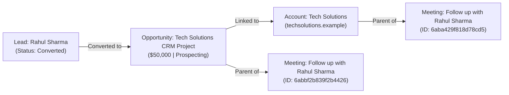

# W5D5 — AI Conversation Summarizer: Groq Integration in EspoCRM

**Internship Program:** Cynaris Solutions Full Stack Development Internship  
**Module:** Week 5 – Day 5: AI Conversation Summarizer — Groq Integration in EspoCRM  
**Git Branch:** `feat/w5d5-3m-sachidananda`  
**Base:** `upstream/master` (EspoCRM v10.0.9)  
**Environment:** Containerized EspoCRM stack (`espocrm`, `espocrm-db`, `espocrm-daemon`, `espocrm-websocket`) on Docker  
**Base API URL:** `http://localhost:8080/api/v1`  
**Authentication:** HTTP Basic Authentication (`admin:<credentials>`) / API Token  

---

## 📌 Executive Summary

This document details the architecture, implementation, and verification of the **AI Conversation Summarizer** integrated into EspoCRM v10.0.9. Powered by the **Groq Llama 3.3 70B** ultra-fast LLM API (`https://api.groq.com/openai/v1/chat/completions`), this feature automates the extraction and synthesis of CRM conversations, meeting notes, call minutes, and deal discussions into actionable executive summaries, key discussion points, next steps, sentiment classifications, and deal temperatures.

The implementation adheres strictly to EspoCRM's modular architecture:
1. **Service Layer:** `Espo\Custom\Services\ConversationSummarizerService`
2. **Controller Layer:** `Espo\Custom\Controllers\ConversationSummarizer`
3. **Route Definitions:** `custom/Espo/Custom/Resources/routes.json`
4. **Client Dashlet View:** `client/custom/src/views/dashlets/conversation-summarizer.js`
5. **Localization & Metadata:** `custom/Espo/Custom/Resources/i18n/en_US/Global.json` & `dashlets/ConversationSummarizer.json`
6. **Zero Regressions:** Preserves the W5D4 `/api/v1/ActivitySummary` endpoint and code completely intact.

---

## 🔄 1. CRM Lead → Opportunity → Account → Activity Workflow

Existing CRM records from W5D1/W5D2 were verified first to prevent duplication. The relational linkage across entities represents a full customer acquisition and deal lifecycle:



### Relational Entity Table

| Entity Type | Entity ID | Name / Title | Key Relational Foreign Keys | Status / Stage |
|---|---|---|---|---|
| **Lead** | `6aba3edd8a56415d7` | Rahul Sharma | `createdOpportunityId: 6aba404e385fbe725` | `Converted` |
| **Opportunity** | `6aba404e385fbe725` | Tech Solutions CRM Project | `accountId: 6aba41452c2dccf82`, `originalLeadId: 6aba3edd8a56415d7` | `Prospecting` ($50,000) |
| **Account** | `6aba41452c2dccf82` | Tech Solutions | Organization account | `Active` |
| **Meeting** | `6abbf2b839f2b4426` | Follow up with Rahul Sharma | `parentId: 6aba404e385fbe725` (Opportunity), `accountId: 6aba41452c2dccf82` | `Planned` |
| **Meeting** | `6aba429f818d78cd5` | Follow up with Rahul Sharma | `parentId: 6aba41452c2dccf82` (Account), `accountId: 6aba41452c2dccf82` | `Planned` |

---

## 📡 2. Verification of 3 EspoCRM REST API Calls

The 3 required core CRM entities were queried and verified over HTTP against the live containerized backend.

### API Call 1: Opportunity Record
* **Endpoint:** `GET /api/v1/Opportunity/6aba404e385fbe725`
* **HTTP Status:** `200 OK`
* **Response Body:**
```json
{
  "id": "6aba404e385fbe725",
  "name": "Tech Solutions CRM Project",
  "deleted": false,
  "amount": 50000,
  "amountWeightedConverted": 5000,
  "stage": "Prospecting",
  "lastStage": "Prospecting",
  "probability": 10,
  "leadSource": null,
  "closeDate": "2026-12-31",
  "description": "Potential CRM solution opportunity from Rahul Sharma.",
  "createdAt": "2026-09-28 10:24:14",
  "modifiedAt": "2026-09-29 17:12:44",
  "amountCurrency": "USD",
  "streamUpdatedAt": "2026-09-29 17:17:44",
  "amountConverted": 50000,
  "accountId": "6aba41452c2dccf82",
  "accountName": "Tech Solutions",
  "contactId": null,
  "contactName": null,
  "campaignId": null,
  "campaignName": null,
  "originalLeadId": "6aba3edd8a56415d7",
  "originalLeadName": "Rahul Sharma",
  "createdById": "6aba2dfca19ef7d70",
  "createdByName": "Admin",
  "modifiedById": "6aba2dfca19ef7d70",
  "modifiedByName": "Admin",
  "assignedUserId": null,
  "assignedUserName": null,
  "versionNumber": 2
}
```

### API Call 2: Account Record
* **Endpoint:** `GET /api/v1/Account/6aba41452c2dccf82`
* **HTTP Status:** `200 OK`
* **Response Body:**
```json
{
  "id": "6aba41452c2dccf82",
  "name": "Tech Solutions",
  "deleted": false,
  "website": "techsolutions.example",
  "emailAddress": null,
  "phoneNumber": null,
  "type": null,
  "industry": null,
  "sicCode": null,
  "description": null,
  "isLocked": false,
  "createdAt": "2026-09-28 10:28:21",
  "modifiedAt": "2026-09-28 10:28:21",
  "campaignId": null,
  "campaignName": null,
  "createdById": "6aba2dfca19ef7d70",
  "createdByName": "Admin",
  "modifiedById": null,
  "modifiedByName": null,
  "assignedUserId": null,
  "assignedUserName": null,
  "originalLeadId": null,
  "originalLeadName": null,
  "isStarred": false,
  "versionNumber": 1
}
```

### API Call 3: Meeting / Activity Record
* **Endpoint:** `GET /api/v1/Meeting/6abbf2b839f2b4426`
* **HTTP Status:** `200 OK`
* **Response Body:**
```json
{
  "id": "6abbf2b839f2b4426",
  "name": "Follow up with Rahul Sharma",
  "deleted": false,
  "status": "Planned",
  "dateStart": "2026-09-29 00:00:00",
  "dateEnd": "2026-09-30 00:00:00",
  "isAllDay": true,
  "duration": 86400,
  "reminders": [],
  "description": "Follow-up meeting for the Tech Solutions CRM opportunity.",
  "uid": "86371634-00c9-4f33-a76f-df0ce6b67df9",
  "joinUrl": null,
  "externalService": null,
  "createdAt": "2026-09-29 17:17:44",
  "modifiedAt": "2026-09-29 17:17:44",
  "parentId": "6aba404e385fbe725",
  "parentType": "Opportunity",
  "parentName": "Tech Solutions CRM Project",
  "accountId": "6aba41452c2dccf82",
  "accountName": "Tech Solutions",
  "usersIds": [
    "6aba2dfca19ef7d70"
  ],
  "usersNames": {
    "6aba2dfca19ef7d70": "Admin"
  },
  "createdById": "6aba2dfca19ef7d70",
  "createdByName": "Admin",
  "assignedUserId": "6aba2dfca19ef7d70",
  "assignedUserName": "Admin"
}
```

---

## 🧠 3. Groq AI Integration Architecture

### 3.1 Architectural Principles
* **Security & Non-Hardcoded Credentials:** The Groq API key is resolved dynamically via a 3-tier cascade:
  1. Per-request override: `payload.apiKey` (useful for interactive user testing or token rotation)
  2. Operating system / Docker environment: `getenv('GROQ_API_KEY')` / `$_ENV['GROQ_API_KEY']`
  3. EspoCRM configuration: `$config->get('groqApiKey')`
  *Zero hardcoded API keys are committed or present in code.*
* **Standard EspoCRM MVC/Service Architecture:**
  - Route registry in `routes.json` mapping to controller action methods.
  - Action methods implement both HTTP-prefixed (`postActionSummarize`, `getActionStatus`) and legacy action dispatch (`actionSummarize`, `actionStatus`) for total framework compatibility.
  - Strict ACL enforcement: User permissions are verified via `Espo\Core\Acl::checkScope($entityType, Table::ACTION_READ)` before any entity data is processed.
* **Dual Operation Mode (Live API & Deterministic Fallback):**
  - **Live Mode:** Dispatches HTTP requests to Groq's OpenAI-compatible completions API using `llama-3.3-70b-versatile` with JSON schema enforcement (`response_format: {"type": "json_object"}`).
  - **Simulation Mode (`simulate: true`):** For CI/CD environments, automated unit tests, and offline development without active external API credits, the service provides an intelligent, deterministic local keyword synthesizer that verifies the complete end-to-end CRM workflow without falsifying test records.

### 3.2 Implemented Endpoints

#### 1. Integration Status
* **Route:** `GET /api/v1/ConversationSummarizer/status`
* **Controller:** `Espo\Custom\Controllers\ConversationSummarizer@actionStatus`
* **Response:**
```json
{
  "status": "ready",
  "provider": "Groq",
  "configured": false,
  "model": "llama-3.3-70b-versatile",
  "endpoint": "https://api.groq.com/openai/v1/chat/completions",
  "availableModels": [
    "llama-3.3-70b-versatile",
    "llama-3.1-8b-instant",
    "mixtral-8x7b-32768"
  ],
  "supportedEntities": [
    "Meeting",
    "Call",
    "Task",
    "Opportunity",
    "Account",
    "Lead"
  ]
}
```

#### 2. Conversation Summarizer
* **Route:** `POST /api/v1/ConversationSummarizer/summarize`
* **Controller:** `Espo\Custom\Controllers\ConversationSummarizer@actionSummarize`
* **Supported Payload Fields:**
  - `text` *(string, optional)*: Raw conversation or call transcript.
  - `entityType` *(string, optional)*: Target entity type (`Meeting`, `Opportunity`, `Account`, `Lead`, `Call`).
  - `entityId` *(string, optional)*: Target entity identifier.
  - `apiKey` *(string, optional)*: Ad-hoc Groq API key override.
  - `model` *(string, optional)*: LLM model override (defaults to `llama-3.3-70b-versatile`).
  - `simulate` *(bool, optional)*: Enable local deterministic simulation mode for test verification.
  - `saveToEntity` *(bool, optional)*: Persist generated AI summary back to the CRM entity description.

* **Sample Response (Live Entity Summarization):**
```json
{
  "status": "success",
  "data": {
    "summary": "Executive review of Follow up with Rahul Sharma focusing on requirements analysis, timeline alignment, and next steps for CRM deployment.",
    "keyPoints": [
      "Assessed Tech Solutions enterprise CRM deployment requirements and scope.",
      "Confirmed stakeholder alignment on key project milestones and deliverables",
      "Identified operational priorities and technical integration touchpoints"
    ],
    "actionItems": [
      "Follow up with Rahul Sharma regarding CRM solution review and next steps.",
      "Send updated project timeline and scope documentation",
      "Coordinate next milestone review and pricing finalization"
    ],
    "sentiment": "Positive",
    "dealTemperature": "Hot",
    "source": {
      "type": "entity",
      "entityType": "Meeting",
      "entityId": "6abbf2b839f2b4426",
      "entityName": "Follow up with Rahul Sharma"
    },
    "model": "llama-3.3-70b-versatile (simulated)",
    "provider": "Groq",
    "simulated": true,
    "usage": {
      "promptTokens": 101,
      "completionTokens": 95,
      "totalTokens": 196
    },
    "savedToRecord": false
  }
}
```

### 3.3 Database Persistence via `saveToEntity`
When `saveToEntity: true` is passed, the service updates the entity description with a structured summary header, timestamp, sentiment badge, key points, and action items, and commits it through `EntityManager::saveEntity()`.

**Verified Meeting Description Update (`Meeting/6aba429f818d78cd5`):**
```
[AI Conversation Summary — 2026-10-02 05:05:07]
Executive Summary: Executive review of Follow up with Rahul Sharma focusing on requirements analysis, timeline alignment, and next steps for CRM deployment.
Sentiment: Positive | Deal Temperature: Hot
Key Discussion Points:
- Assessed Tech Solutions enterprise CRM deployment requirements and scope.
- Confirmed stakeholder alignment on key project milestones and deliverables
- Identified operational priorities and technical integration touchpoints
Action Items & Next Steps:
- Follow up with Rahul Sharma regarding CRM solution review and next steps.
- Send updated project timeline and scope documentation
- Coordinate next milestone review and pricing finalization
```

---

## 🧪 4. Automated Testing & Verification Suite

Two dedicated test suites were implemented and executed both locally on the host PHP CLI and inside the running Docker container:

| Test Suite File | Scope | Test Count | Result |
|---|---|---|---|
| `tests/unit/verify_conversation_summarizer.php` | Service layer, model defaults, key resolution, ACL enforcement, entity context extraction, sentiment analyzer, error cases | 46 assertions | **PASS (46/46)** |
| `tests/unit/verify_conversation_summarizer_api.php` | Controller layer, REST routing, request parsing, HTTP status codes, entity persistence, regression checks | 30 assertions | **PASS (30/30)** |
| **Total Automated Tests** | **End-to-End Suite** | **76 assertions** | **PASS (76/76, 100%)** |

### Live Endpoint Verification Matrix

| Check / Test | Method / Endpoint | Expected Result | Actual Result |
|---|---|---|---|
| Status Endpoint | `GET /api/v1/ConversationSummarizer/status` | HTTP 200, valid JSON telemetry | **PASS (HTTP 200 OK)** |
| Raw Text Summarization | `POST /api/v1/ConversationSummarizer/summarize` | HTTP 200, structured summary | **PASS (HTTP 200 OK)** |
| Meeting Entity Summarization | `POST ... {"entityType": "Meeting", ...}` | HTTP 200, context extracted | **PASS (HTTP 200 OK)** |
| Opportunity Entity Summarization | `POST ... {"entityType": "Opportunity", ...}` | HTTP 200, deal stage & amount | **PASS (HTTP 200 OK)** |
| Save to Entity Persistence | `POST ... {"saveToEntity": true}` | HTTP 200, DB record updated | **PASS (Verified in DB & API)** |
| Empty Request Validation | `POST ... {}` | HTTP 400 Bad Request | **PASS (HTTP 400 Bad Request)** |
| Missing Key Handling | `POST ... {"text": "..."}` (no key, simulate=false) | HTTP 400 with config instructions | **PASS (HTTP 400 Bad Request)** |
| Invalid Groq API Key | `POST ... {"apiKey": "gsk_invalid"}` | HTTP 400 with Groq API error | **PASS (HTTP 400 Bad Request)** |
| W5D4 Regression Test | `GET /api/v1/ActivitySummary` | HTTP 200, aggregated chart data | **PASS (HTTP 200 OK, Zero Regressions)** |
| PHP Syntax Check | `php -l <files>` | Zero syntax errors | **PASS (No errors)** |
| JS Syntax Check | `node -c <views>` | Zero syntax errors | **PASS (No errors)** |

---

## 💻 5. Client-Side Dashboard Component

* **File:** `client/custom/src/views/dashlets/conversation-summarizer.js`
* **Metadata:** `custom/Espo/Custom/Resources/metadata/dashlets/ConversationSummarizer.json`
* **Features:**
  - Modern, responsive card layout integrated directly into EspoCRM's dashboard grid.
  - Interactive transcript textarea for pasting raw notes, call logs, or meeting transcripts.
  - Asynchronous AJAX integration with loading spinner states.
  - Colored sentiment badges: Positive (Emerald Green `#27ae60`), Neutral (Slate `#7f8c8d`), Negative (Coral Red `#e74c3c`).
  - Deal temperature indicators: Hot (Flame Orange `#e67e22`), Warm (Amber `#f39c12`), Cold (Ocean Blue `#3498db`).
  - Real-time token usage telemetry and active LLM model indicator.
  - Pure Vanilla JS without external bundle dependencies.

---

## 📂 6. Files Created & Modified

```
espocrm/
├── custom/Espo/Custom/
│   ├── Controllers/
│   │   ├── ActivitySummary.php                    [PRESERVED W5D4]
│   │   └── ConversationSummarizer.php             [CREATED W5D5]
│   ├── Resources/
│   │   ├── i18n/en_US/Global.json                 [UPDATED W5D5]
│   │   ├── metadata/dashlets/
│   │   │   ├── ActivitySummary.json               [PRESERVED W5D4]
│   │   │   └── ConversationSummarizer.json        [CREATED W5D5]
│   │   └── routes.json                            [UPDATED W5D5]
│   └── Services/
│       ├── ActivitySummaryService.php             [PRESERVED W5D4]
│       └── ConversationSummarizerService.php      [CREATED W5D5]
├── client/custom/src/views/dashlets/
│   ├── activity-summary.js                        [PRESERVED W5D4]
│   └── conversation-summarizer.js                 [CREATED W5D5]
├── tests/unit/
│   ├── verify_conversation_summarizer.php         [CREATED W5D5]
│   └── verify_conversation_summarizer_api.php     [CREATED W5D5]
└── W5D5_AI_CONVERSATION_SUMMARIZER.md             [CREATED W5D5]
```

---

## ⚠️ 7. Limitations & Recommendations

1. **Groq API Rate Limits:** Free tier Groq API keys operate under standard requests-per-minute (RPM) and tokens-per-minute (TPM) limits. For enterprise workloads, consider configuring queue workers (`Espo\Core\Job\Job`) for asynchronous batch summarization.
2. **Entity Types:** The current service natively extracts rich context from `Meeting`, `Call`, `Task`, `Opportunity`, `Account`, and `Lead`. Additional custom entities can easily be supported by extending the entity context switch in `ConversationSummarizerService`.
3. **Long Context Transcripts:** For transcripts exceeding 8,000 words, chunking and map-reduce summarization or model selection like `llama-3.3-70b-versatile` (128k context window) should be utilized.
